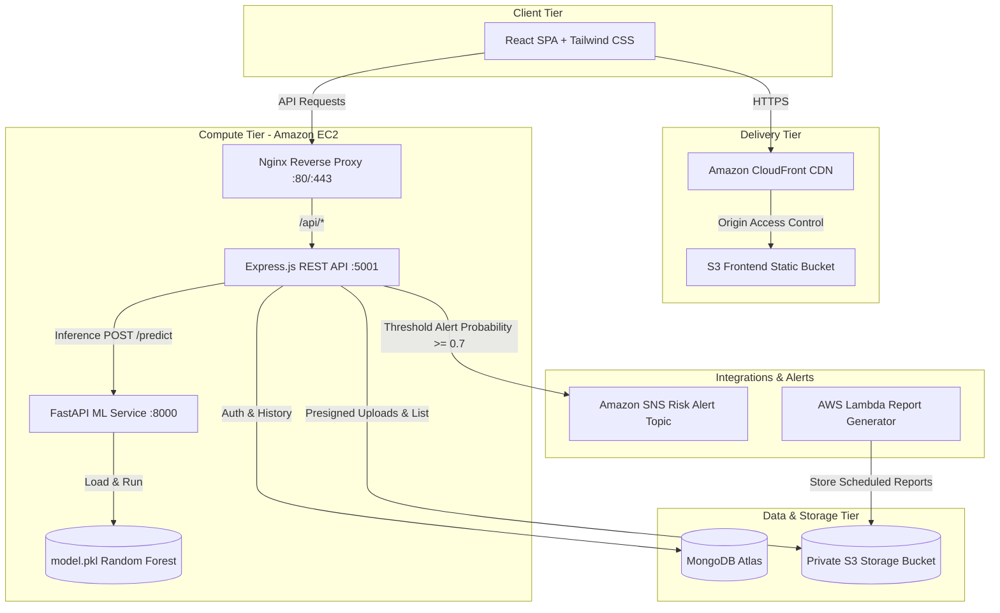

# FireGuard: Wildfire Risk Prediction System

FireGuard is a full-stack, software-only wildfire risk classification application. It combines a modern React dashboard, an Express REST API, a MongoDB datastore, and a Python FastAPI microservice serving a serialized Random Forest classification model.

> [!NOTE]
> FireGuard is a prototype software classification system. It does not provide certified real-world emergency warnings or official public-safety alerts.

---

## 1. Project Overview & Architecture

FireGuard allows users to authenticate, inspect simulated or manual environmental conditions (Temperature, Oxygen Level, Humidity, Wind Speed, Pressure, Rainfall), obtain classification predictions and probability scores from the machine learning model, store historical records, upload files via secure S3 presigned URLs, and receive automated SNS notifications when risk thresholds are exceeded.

### Architecture Diagram



---

## 2. Technology Stack

- **Frontend**: React 18, Vite, Tailwind CSS, Recharts, React Router DOM, Axios
- **Backend API**: Node.js 22 LTS, Express 5, Mongoose 8, Zod, Helmet, Express Rate Limit, bcryptjs, JSON Web Tokens (JWT), AWS SDK v3
- **ML Service**: Python 3.12, FastAPI, Uvicorn, scikit-learn 1.5, pandas, numpy, pydantic
- **Asynchronous Reports**: AWS Lambda (Node.js 22.x ES Modules)
- **Database**: MongoDB / MongoDB Atlas
- **AWS Infrastructure**: S3 (Private Buckets + OAC), CloudFront, EC2 (Ubuntu 24.04), SNS, IAM, CloudWatch

---

## 3. Local Setup Instructions

### Prerequisites
- Node.js (v20+ or v22 LTS recommended)
- Python 3.12
- MongoDB installed locally (`mongod`) or a MongoDB Atlas connection string

### Step-by-Step Installation

```bash
# 1. Clone repository and navigate to root
git clone <repository-url> forest-fire-risk-prediction
cd forest-fire-risk-prediction

# 2. Configure environment variables
cp .env.example .env
cp backend/.env.example backend/.env
cp frontend/.env.example frontend/.env

# 3. Install backend dependencies
cd backend && npm install

# 4. Install frontend dependencies
cd ../frontend && npm install

# 5. Setup Python ML service environment
cd ../ml-service
python3 -m venv .venv
source .venv/bin/activate
pip install -r requirements.txt

# Ensure model artifact is present in model directory
if [ ! -f model/model.pkl ]; then
  cp ../model.pkl model/model.pkl
fi
```

---

## 4. MongoDB Setup Instructions

### Local MongoDB
Start MongoDB locally using your system service manager or standalone configuration:
```bash
# Using Homebrew on macOS:
mongod --config /opt/homebrew/etc/mongod.conf

# Or standalone data directory:
mkdir -p data/db
mongod --dbpath ./data/db --port 27017
```

### MongoDB Atlas (Production & Cloud Setup)
1. Create a free M0 cluster at [MongoDB Atlas](https://www.mongodb.com/atlas).
2. Under **Database Access**, create a database user and generate a secure password.
3. Under **Network Access**, add the public IP of your development machine or the EC2 Elastic IP (`0.0.0.0/0` with caution for dynamic IPs).
4. Copy the SRV connection string into `.env` and `backend/.env`:
   ```env
   MONGODB_URI=mongodb+srv://<username>:<password>@cluster0.abcde.mongodb.net/forest_fire_db?retryWrites=true&w=majority
   ```

---

## 5. Environment Variables Setup

### Backend (`backend/.env` and `.env`)
| Variable | Description | Default / Example |
|---|---|---|
| `NODE_ENV` | Application environment (`development` or `production`) | `development` |
| `PORT` | HTTP port the Express server listens on (**5001** to avoid macOS AirPlay conflict) | `5001` |
| `MONGODB_URI` | MongoDB connection URI | `mongodb://localhost:27017/forest_fire_db` |
| `JWT_SECRET` | Secret key for signing JSON Web Tokens (min 32 chars) | `<long-random-string>` |
| `ML_SERVICE_URL` | Base URL of the internal Python FastAPI ML service | `http://127.0.0.1:8000` |
| `FRONTEND_ORIGIN` | Allowed CORS origins (comma-separated for multiple) | `http://localhost:5173,http://127.0.0.1:5173` |
| `AWS_REGION` | Target AWS region for S3 and SNS integrations | `us-east-1` |
| `AWS_S3_BUCKET` | Name of the private S3 bucket for file uploads | `fireguard-storage-<account-id>` |
| `AWS_SNS_TOPIC_ARN`| ARN of the SNS topic for risk notifications | `arn:aws:sns:us-east-1:<account-id>:fireguard-risk-alerts` |
| `SNS_RISK_THRESHOLD`| Minimum class 1 probability to trigger an SNS alert | `0.7` |
| `REPORT_BUCKET` | Bucket where Lambda stores generated reports | `fireguard-storage-<account-id>` |

### Frontend (`frontend/.env`)
| Variable | Description | Default / Example |
|---|---|---|
| `VITE_API_URL` | Public base URL for Express backend API | `http://localhost:5001/api` |

---

## 6. Running Services Locally

Start the three core services in separate terminal windows:

### Terminal 1: Python ML Service
```bash
cd ml-service
source .venv/bin/activate
uvicorn app:app --host 127.0.0.1 --port 8000 --reload
```
Health Check: `http://127.0.0.1:8000/health`

### Terminal 2: Node.js Express Backend
```bash
cd backend
npm run dev
```
Health Check: `http://localhost:5001/health` and `http://localhost:5001/api/health`

### Terminal 3: React Frontend Dashboard
```bash
cd frontend
npm run dev
```
Access the application at `http://localhost:5173`.

---

## 7. How to Stop and Restart Local Services

### Stopping Services
- In terminal windows: press `Ctrl + C`.
- To stop background processes:
  ```bash
  # Check active ports
  lsof -i :5001   # Backend
  lsof -i :8000   # ML Service
  lsof -i :5173   # Frontend
  
  # Kill specific PID
  kill <PID>
  ```

### Restarting
```bash
# Restart Backend
cd backend && npm run dev

# Restart ML Service
cd ml-service && source .venv/bin/activate && uvicorn app:app --port 8000
```

---

## 8. API Endpoints

### Health Checks
- `GET /health`: Overall system and database connection status.
- `GET /api/health`: Equivalent endpoint scoped under `/api`.

### Authentication
- `POST /api/auth/register`: Create user account (`name`, `email`, `password`). Returns JWT and user object.
- `POST /api/auth/login`: Authenticate existing user (`email`, `password`). Returns JWT.
- `GET /api/auth/me`: Get current authenticated user profile (`Bearer <token>`).
- `PATCH /api/auth/notifications`: Enable or disable SNS risk notifications for the user.

### Predictions & Simulation
- `GET /api/environment/simulated`: Returns random bounded environmental test values.
- `POST /api/predictions`: Send environmental readings to ML service, store result, and optionally notify via SNS.
- `GET /api/predictions`: List user's past predictions (supports `?limit=N`).
- `GET /api/predictions/stats`: Summary statistics (total, risky count, average probability).
- `GET /api/predictions/:id`: Fetch individual prediction details.

### Storage & Files (AWS S3)
- `POST /api/files/upload-url`: Generate private S3 presigned PUT URL for upload.
- `GET /api/files`: List files uploaded by the authenticated user.

---

## 9. Testing Instructions

Run the test suites across all project tiers:

```bash
# 1. Backend tests (Node test runner)
npm --prefix backend test

# 2. Frontend tests (Vitest)
npm --prefix frontend test

# 3. Frontend production build
npm --prefix frontend run build

# 4. ML Service unit tests (Python unittest)
cd ml-service && .venv/bin/python -m unittest -v test_ml_service.py && cd ..

# 5. Lambda unit tests
npm --prefix lambda test

# 6. End-to-end automated deployment verification smoke test
./scripts/verify-deployment.sh http://localhost:5001 http://127.0.0.1:8000
```

---

## 10. AWS Architecture & Deployment Guide

### 100% Zero-Cost AWS Free Tier Architecture
FireGuard is architected to run with **zero infrastructure cost ($0.00/month)**:
- **EC2 Compute**: `t2.micro` or `t3.micro` (750 hours/month Free Tier).
- **Automated Memory Swap**: `scripts/setup-ec2.sh` creates 2 GB of swap space so micro instances (1 GB RAM) run Node and Python without memory exhaustion.
- **Reverse Proxy**: Nginx directly on EC2 (costs $0 vs ~$18/month for an AWS Application Load Balancer).
- **Public Subnet Architecture**: Direct security group filtering (costs $0 vs ~$32/month for a NAT Gateway).
- **Frontend CDN**: CloudFront + S3 (1 TB transfer free per month).
- **Database**: MongoDB Atlas M0 Sandbox (Free forever).

### CloudFormation Infrastructure Provisioning (Recommended)
An Infrastructure-as-Code template is available at `infra/fireguard-infra.yaml`. It provisions:
- S3 Bucket for frontend hosting with CloudFront Origin Access Control (OAC).
- CloudFront distribution configured with HTTPS and SPA routing (403/404 $\rightarrow$ `index.html`).
- Private S3 Bucket for user uploads and Lambda reports with encryption enabled.
- Amazon SNS Topic for wildfire risk notifications.
- Least-privilege IAM Roles and Instance Profiles for EC2 and Lambda.
- EC2 Security Group restricting traffic (ports 80/443 public, port 22 restricted).

To deploy the CloudFormation stack:
```bash
aws cloudformation create-stack \
  --stack-name fireguard-production \
  --template-body file://infra/fireguard-infra.yaml \
  --capabilities CAPABILITY_NAMED_IAM \
  --parameters ParameterKey=EnvironmentName,ParameterValue=production \
               ParameterKey=InstanceType,ParameterValue=t2.micro \
               ParameterKey=AdministratorCIDR,ParameterValue="$(curl -s https://checkip.amazonaws.com)/32"
```

### EC2 Backend & ML Service Setup
1. Launch an Ubuntu 24.04 LTS instance using **`t2.micro`** or **`t3.micro`** (Free Tier eligible).
2. Attach the IAM Instance Profile created by CloudFormation (`fireguard-ec2-profile-production`).
3. Associate the security group (`fireguard-ec2-sg-production`).
4. SSH into the instance and run the automated provisioning script (it automatically configures swap, Node.js, Python, systemd, and Nginx):
   ```bash
   git clone <repository-url> /opt/fireguard
   cd /opt/fireguard
   chmod +x scripts/setup-ec2.sh
   ./scripts/setup-ec2.sh
   ```
5. Configure production variables in `/opt/fireguard/backend/.env`:
   ```bash
   sudo nano /opt/fireguard/backend/.env
   sudo systemctl restart fireguard-backend
   ```

### Frontend Deployment
Run the automated deployment script to build and sync frontend assets to S3 and invalidate CloudFront:
```bash
chmod +x scripts/deploy-frontend.sh
./scripts/deploy-frontend.sh <frontend-s3-bucket> https://<your-ec2-or-api-domain>/api <cloudfront-distribution-id>
```

### Lambda Report Generator Deployment
Package and deploy the Lambda function:
```bash
chmod +x scripts/package-lambda.sh
./scripts/package-lambda.sh fireguard-report-generator <lambda-execution-role-arn>
```

---

## 11. IAM Permissions (Least Privilege)

### EC2 Instance Role
- **S3**: `s3:PutObject`, `s3:GetObject`, `s3:ListBucket` scoped strictly to `arn:aws:s3:::fireguard-storage-*`.
- **SNS**: `sns:Publish` scoped strictly to `arn:aws:sns:*:*:fireguard-risk-alerts-*`.
- **CloudWatch Logs**: `logs:CreateLogStream`, `logs:PutLogEvents`.
- **No static keys**: Workload uses IAM Instance Profile metadata tokens automatically.

### Lambda Execution Role
- `s3:PutObject` scoped strictly to `arn:aws:s3:::fireguard-storage-*/reports/*`.
- `AWSLambdaBasicExecutionRole` for CloudWatch logging.

---

## 12. Troubleshooting Guide

### 1. Account Creation Fails with "Unable to create account" (Port 5000 Conflict on macOS)
- **Cause**: macOS AirPlay Receiver (`ControlCenter`) listens on port 5000 by default. Incoming requests are intercepted by Apple AirTunes (`403 Forbidden`) without CORS headers.
- **Fix**: FireGuard uses port **5001** for the backend. Ensure `PORT=5001` in `backend/.env` and `VITE_API_URL=http://localhost:5001/api` in `frontend/.env`.

### 2. MongoDB Connection Error / Buffering Timeout
- **Cause**: Local MongoDB service is stopped or Atlas network IP is not whitelisted.
- **Fix**: Run `mongod --config /opt/homebrew/etc/mongod.conf` or verify your current IP in MongoDB Atlas Network Access.

### 3. ML Service Returns 503 "ML model is not loaded"
- **Cause**: `model.pkl` is missing from `ml-service/model/model.pkl`.
- **Fix**: Ensure the model artifact is copied: `cp model.pkl ml-service/model/model.pkl`.

### 4. CORS Errors in Browser Console
- **Cause**: Frontend accessed from an origin not listed in `FRONTEND_ORIGIN`.
- **Fix**: Set `FRONTEND_ORIGIN=http://localhost:5173,http://127.0.0.1:5173` (or your production CloudFront domain).

---

## 13. Security Considerations

- **Secrets Management**: Secrets (`JWT_SECRET`, `MONGODB_URI`) are never committed to version control. All `.env*` files except `.env.example` are ignored by `.gitignore`.
- **Password Protection**: Passwords are encrypted using `bcryptjs` with 12 salt rounds. Plain-text passwords are never persisted to database objects or logged.
- **Public Surface Minimization**: The ML service listens strictly on loopback (`127.0.0.1:8000`) and is never directly exposed to the internet.
- **Reverse Proxy**: Nginx proxies only `/api/` traffic to Express, drops unsupported methods, and applies rate limiting.
- **Storage Protection**: All S3 buckets enforce S3 Block Public Access. File uploads are performed exclusively through time-limited presigned URLs.
